# Sistema de Gestión de Biblioteca Académica

Proyecto de base de datos relacional para administrar préstamo, devolución
y consulta de libros en una biblioteca académica. Incluye diseño ER,
scripts DDL/DML, consultas SQL (con JOIN, agrupaciones y subconsultas),
un cliente en Python y el entorno de base de datos levantado con **Podman**.

## Stack utilizado

- **Podman** — contenedor con PostgreSQL 16 (base de datos).
- **Git Bash** — terminal para ejecutar comandos de Podman/Git.
- **Python 3** + `psycopg2` — conexión y ejecución de scripts desde código.
- **VS Code** — edición del proyecto (recomendable con la extensión
  "SQLTools" o "PostgreSQL" para explorar la BD, y "Python").

## Estructura del repositorio

biblioteca-academica/
├── README.md
├── docs/
│ └── diagrama_er.md # Diagrama entidad-relación (Mermaid)
├── sql/
│ ├── 01_ddl_create_database.sql
│ ├── 02_dml_insert_data.sql
│ ├── 03_queries_select.sql
│ └── 04_dml_update_delete.sql
├── python/
│ ├── requirements.txt
│ ├── .env.example
│ ├── db_connection.py
│ └── run_scripts.py
├── podman/
│ ├── setup_podman.sh # Levanta el contenedor PostgreSQL
│ └── load_sql.sh # Carga los scripts vía psql
├── webapp/ # Panel web (Flask) para explorar y editar la BD
│ ├── app.py
│ ├── config.py
│ ├── db.py
│ ├── requirements.txt
│ ├── .env.example
│ ├── templates/
│ └── static/css/style.css
└── evidence/ # Aquí van tus capturas de pantalla


## 1. Levantar la base de datos con Podman

Instala Podman Desktop (Windows) y, en Git Bash:

```bash
podman machine init
podman machine start

cd podman
bash setup_podman.sh
```

Esto descarga la imagen `postgres:16`, crea un volumen persistente y
levanta el contenedor `biblioteca_pg` escuchando en `localhost:5432`
con:
- usuario: `biblioteca_user`
- password: `biblioteca_pass`
- base de datos: `biblioteca_academica`

Verifica que esté corriendo:
```bash
podman ps
```

## 2. Cargar el esquema y los datos

**Opción A — directo con psql dentro del contenedor (rápido, sin Python):**
```bash
cd podman
bash load_sql.sh
```

**Opción B — desde Python (recomendado si quieres ver también la salida
de las consultas formateada en consola, como evidencia de ejecución):**
```bash
cd python
python -m venv venv
source venv/Scripts/activate        # Git Bash en Windows
pip install -r requirements.txt

cp .env.example .env                # ajusta credenciales si las cambiaste

python run_scripts.py --all         # ejecuta DDL + DML + todas las consultas
```

Para volver a correr solo las consultas (una vez que ya existen los
datos):
```bash
python run_scripts.py --queries
```

## 3. Evidencia de ejecución

Guarda capturas de pantalla de:
- La salida de `podman ps` mostrando el contenedor activo. 
- La salida de `python run_scripts.py --all` con las tablas de resultados.
- Alguna consulta corrida manualmente con `podman exec -it biblioteca_pg psql ...`

Colócalas dentro de `evidence/` y referencia sus nombres en este README
antes de subir el proyecto a GitHub.

## 📸 Evidencia de Ejecución

### 3.1. Verificación del Contenedor y Consulta Manual
* **Verificación de servicios activados:**  
  

* **Consulta manual directa en terminal (`psql`):**  
  

---

### 3.2. Ejecución Automatizada de Consultas (Script Python)

| Consulta | Descripción / Operación SQL | Captura de Pantalla |
| :--- | :--- | :--- |
| **Consulta 1** | Catálogo general de libros (`ORDER BY`) | 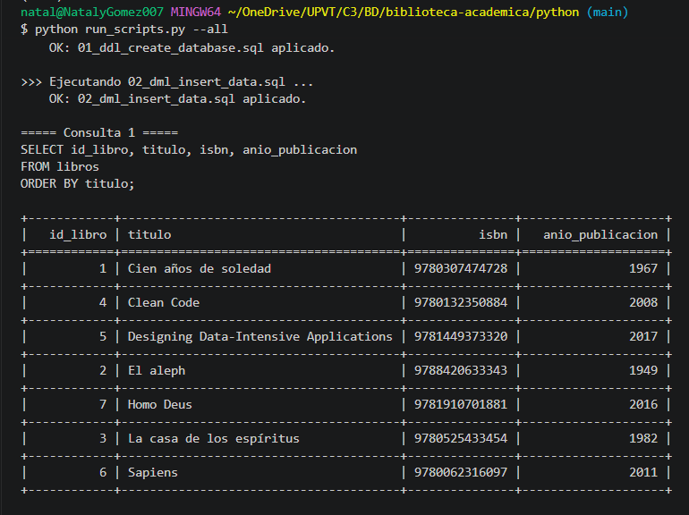 |
| **Consulta 2** | Filtrado por categoría específica (`JOIN` + `WHERE`) | 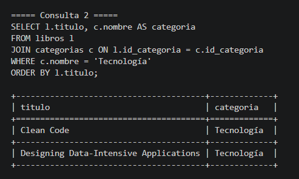 |
| **Consulta 3** | Historial de préstamos y usuarios (`MULTIPLE JOIN`) | 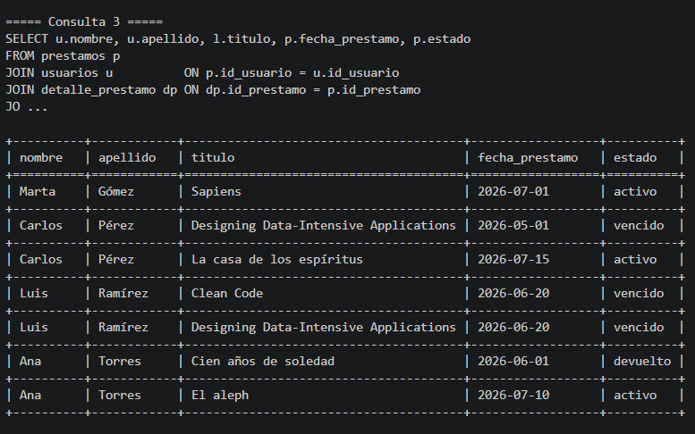 |
| **Consulta 4** | Control de préstamos vencidos y activos | 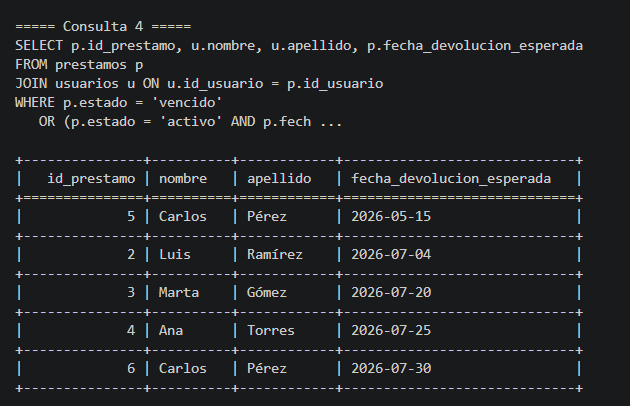 |
| **Consulta 5** | Conteo total de libros por autor (`GROUP BY`) | 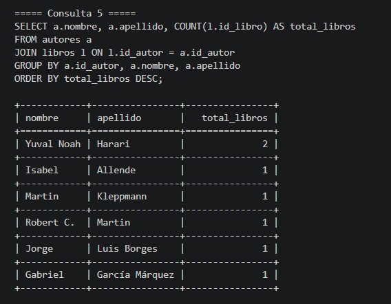 |
| **Consulta 6** | Préstamos acumulados por categoría | 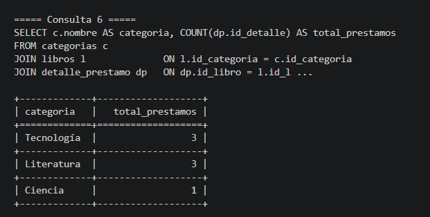 |
| **Consulta 7** | Usuarios frecuentes (`HAVING`) | 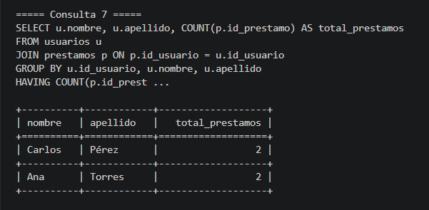 |
| **Consulta 8** | Inventario y ejemplares disponibles | 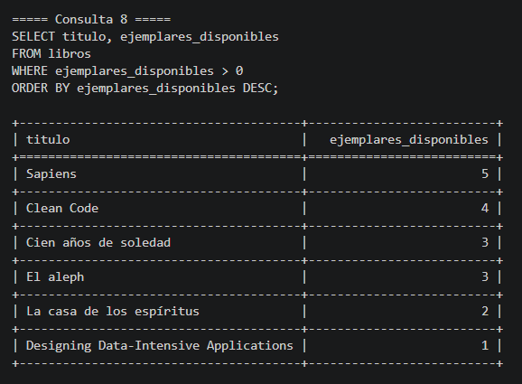 |
| **Consulta 9** | Historial por usuario con Subconsulta | 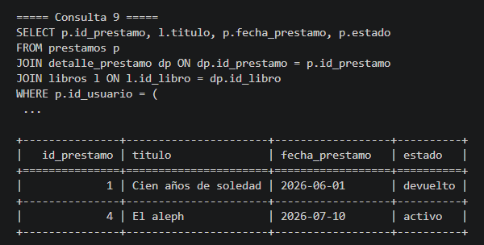 |
| **Consultas 10 y 11** | Libros sin préstamos (`NOT IN`) y Multas pendientes | 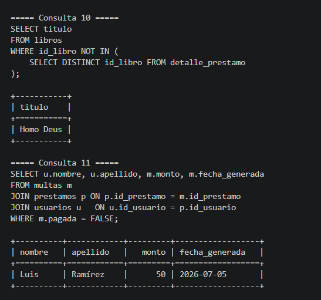 |
| **Consulta 12** | Consolidados de autores y categorías (`UNION`) | 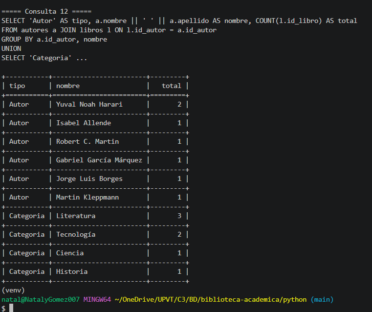 |

### 3.3. Interfaz web (panel de administración)

Además de los scripts SQL, el repositorio incluye una interfaz web
(Flask) para explorar, buscar, crear, editar y eliminar registros de
las 8 tablas sin escribir SQL a mano, con un panel de estadísticas y
una pantalla que muestra el estado de conexión y las credenciales
usadas.

**Levantarla (con el contenedor de Podman ya corriendo):**
```bash
cd webapp
python -m venv venv
source venv/Scripts/activate      # Git Bash en Windows
pip install -r requirements.txt

cp .env.example .env              # ajusta si usaste otras credenciales

flask --app app run --debug
```

Abre **http://127.0.0.1:5000** en el navegador.

**Qué incluye:**
- **Panel general (`/`)**: conteo de registros por tabla, préstamos
  vencidos y multas pendientes de un vistazo.
- **Listado + búsqueda (`/<tabla>`)**: tabla con búsqueda por el campo
  principal de cada entidad (título, nombre, apellido).
- **Alta y edición (`/<tabla>/nuevo`, `/<tabla>/<id>/editar`)**:
  formularios generados automáticamente a partir de `config.py`,
  incluyendo listas desplegables para las llaves foráneas (por
  ejemplo, al crear un libro eliges el autor y la categoría por nombre,
  no por ID).
- **Eliminar**: con confirmación; si el registro está referenciado en
  otra tabla, la base de datos rechaza el borrado y la app muestra el
  motivo.
- **Conexión (`/conexion`)**: host, puerto, base de datos y usuario
  configurados (la contraseña se muestra oculta), estado de la
  conexión en vivo, y cómo se creó ese usuario.

**Usuario de la base de datos: ¿qué debes tener creado?**
1. **Usuario administrador** (`biblioteca_user`, definido por
   `POSTGRES_USER` en `podman/setup_podman.sh`): dueño de todas las
   tablas. Es el que usa la webapp por defecto vía `webapp/.env`.
2. **(Opcional, recomendado) Usuario de aplicación con permisos
   limitados**: corre `sql/05_create_app_role.sql` para crear el rol
   `biblioteca_app`, que solo puede leer/escribir filas (no puede
   borrar tablas ni crear otras bases de datos). Luego actualiza
   `webapp/.env` con `DB_USER=biblioteca_app` y la contraseña que
   hayas definido en ese script.

Ninguna contraseña se sube al repositorio: `.env` está en
`.gitignore`, y solo se versiona `.env.example` como plantilla.

## 4. Modelo de datos

Ver [`docs/diagrama_er.md`](docs/diagrama_er.md) para el diagrama
entidad-relación completo (Mermaid, se visualiza directo en GitHub) y
el diccionario de datos.

Tablas: `autores`, `categorias`, `libros`, `usuarios`, `prestamos`,
`detalle_prestamo`, `devoluciones`, `multas`.

## 5. Contenido cubierto

- **DDL**: `CREATE DATABASE`, `CREATE TABLE`, `PRIMARY KEY`, `FOREIGN KEY`,
  `NOT NULL`, `UNIQUE`, `CHECK`.
- **DML**: `INSERT`, `UPDATE`, `DELETE`.
- **Consultas**: `SELECT`, `WHERE`, `ORDER BY`, `GROUP BY`, `HAVING`,
  `JOIN`, subconsultas, `UNION`.
- **Álgebra relacional**: selección, proyección, unión, diferencia,
  join relacional (comentados dentro de `03_queries_select.sql`).

## 6. Comandos útiles de Git Bash / Podman

```bash
# Ver logs del contenedor
podman logs biblioteca_pg

# Entrar a psql interactivo
podman exec -it biblioteca_pg psql -U biblioteca_user -d biblioteca_academica

# Detener el contenedor
podman stop biblioteca_pg

# Volver a iniciarlo (los datos persisten en el volumen)
podman start biblioteca_pg

# Eliminar todo (contenedor + volumen) para empezar de cero
podman rm -f biblioteca_pg
podman volume rm biblioteca_pgdata
```

## 7. Subir el proyecto a GitHub

```bash
git init
git add .
git commit -m "Proyecto Biblioteca Académica: DDL, DML, consultas y entorno Podman"
git branch -M main
git remote add origin https://github.com/<tu-usuario>/biblioteca-academica.git
git push -u origin main
```

> Nota: no subas el archivo `.env` (contiene credenciales locales). Ya
> está listo `.env.example` como plantilla y se recomienda agregar un
> `.gitignore` con `venv/`, `.env` y `__pycache__/`.