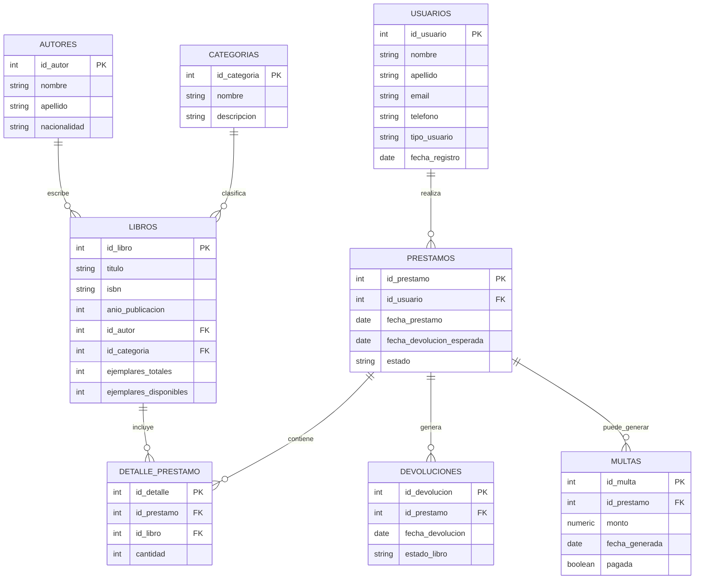

# Diagrama Entidad-Relación

> GitHub renderiza automáticamente los bloques ```mermaid``` en el README o en cualquier .md. También puedes pegar este código en https://mermaid.live para exportarlo como PNG/PDF y adjuntarlo como evidencia.



## Diccionario de datos (resumen)

| Tabla             | Atributo clave         | Relación                                   |
|--------------------|------------------------|---------------------------------------------|
| autores            | id_autor (PK)           | 1 autor → N libros                          |
| categorias         | id_categoria (PK)       | 1 categoría → N libros                      |
| libros             | id_libro (PK)           | referencia a autor y categoría (FK)         |
| usuarios           | id_usuario (PK)         | 1 usuario → N préstamos                     |
| prestamos          | id_prestamo (PK)        | referencia a usuario (FK)                   |
| detalle_prestamo   | id_detalle (PK)         | resuelve relación N:M entre préstamos-libros|
| devoluciones       | id_devolucion (PK)      | referencia a préstamo (FK)                  |
| multas             | id_multa (PK)           | referencia a préstamo (FK)                  |
